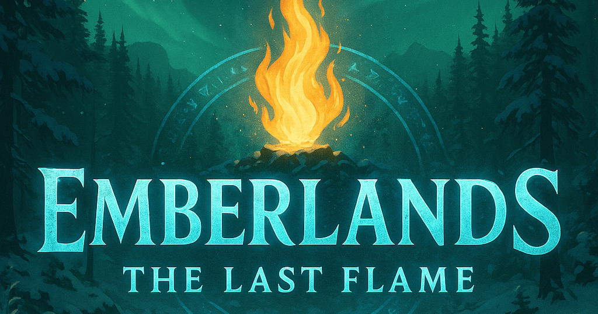
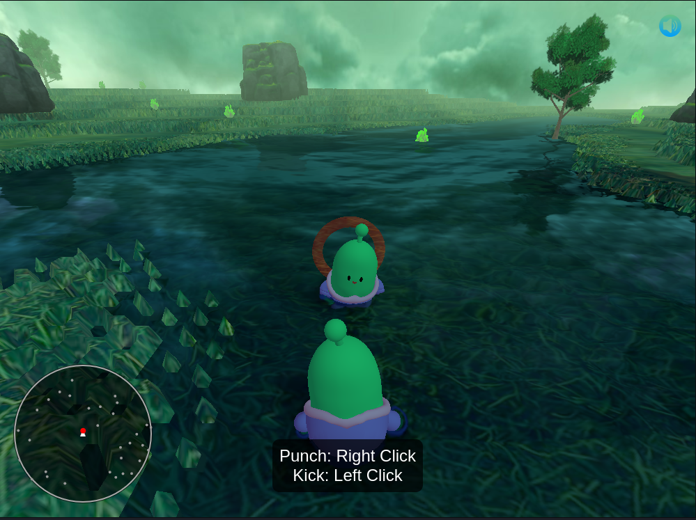
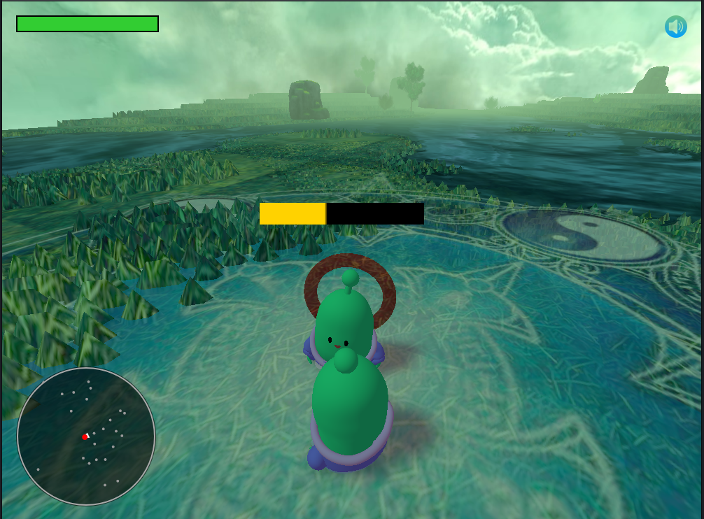
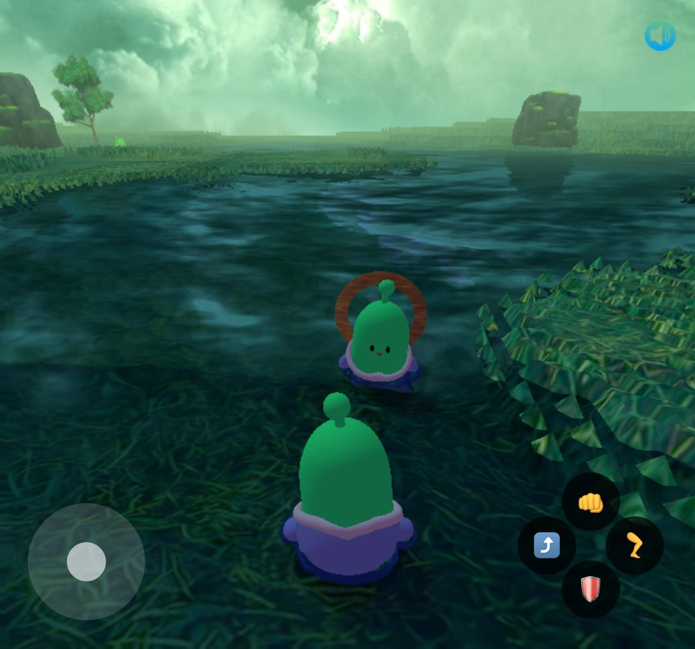
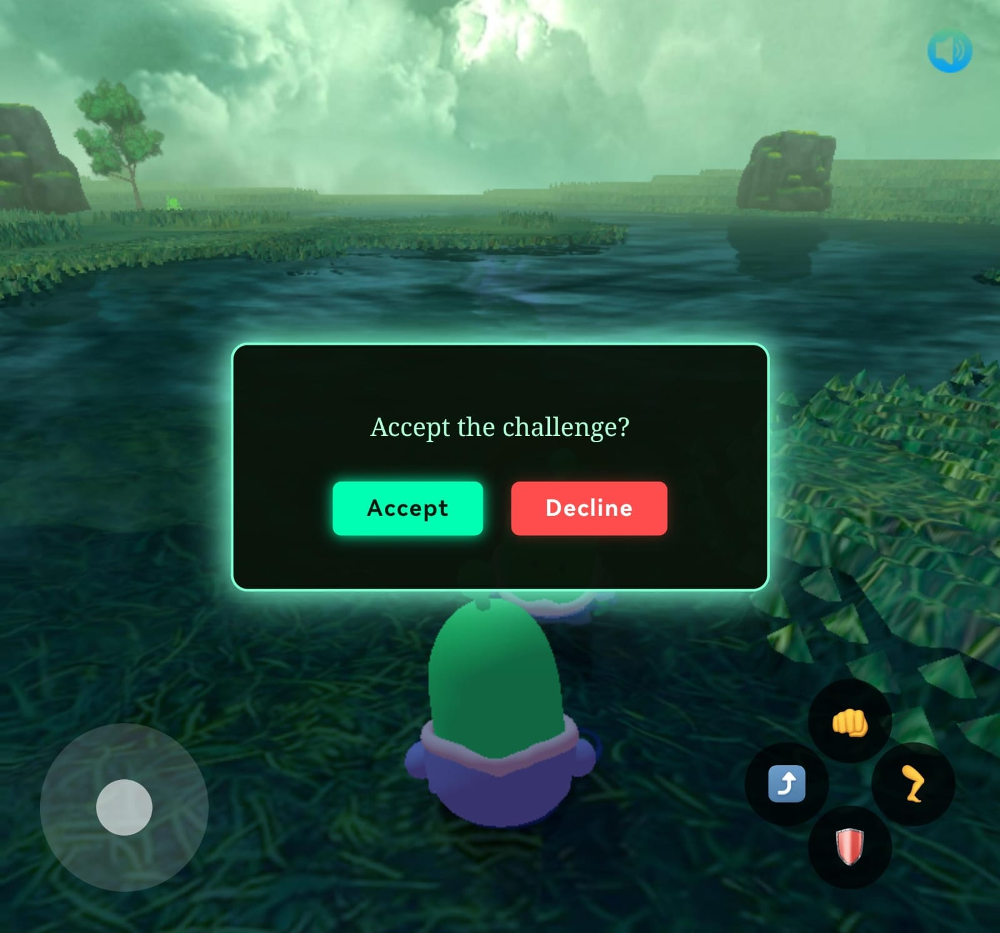

# 🌋 Emberlands: The Last Flame



**Emberlands: The Last Flame** is a browser-based 3D fantasy RPG survival game built with **Three.js**, featuring real-time multiplayer **duels** and physics-based movement. Players explore a mystical land, challenge nearby players to combat in magical summoned arenas, and strive to protect (or conquer) the last flame in a world on the brink.

This project is both a game and a learning journey — combining 3D rendering, physics, multiplayer, and storytelling into one long-term creative experience.

---

## 🎮 Live Demo

🔗 **Play Now**: [https://ember-lands-4d5v.vercel.app](https://ember-lands-4d5v.vercel.app)  
🔌 **Server**: [https://emberlands-server.onrender.com](https://emberlands-server.onrender.com)

> Best experienced on desktop with keyboard and mouse.

---

## 🖼️ Screenshots

### 💻 Desktop Gameplay

 

### 📱 Mobile Preview

 

---

## 🧪 Tech Stack

- 🌐 **Three.js** – 3D graphics and scene management
- 🧱 **Cannon.js** – Physics and collision
- 🧠 **WebSockets** – Real-time multiplayer communication
- ⚡ **Vite** – Frontend build tool
- 🌍 **Node.js** – WebSocket server (hosted on Render)

---

## 🎮 How to Play

### Controls
- `W A S D` – Move
- `Click` – Attack (during duel)
- `Space` – Jump
- Camera follows player in third-person

### Duels
- Move near another player to see the **“Duel!”** button
- Accept or decline a challenge
- If accepted, both players are summoned into a magical arena
- Fight using basic attacks
- First to reduce opponent's health to 0 wins
- Players are then returned to the world with restored health

---

## 🛠️ Running Locally

### 🔧 Prerequisites

- Node.js
- npm or yarn

### 📦 Install

```bash
git clone https://github.com/shamiroxs/emberlands.git
cd emberlands
npm install
````

### ▶️ Start Vite Frontend

```bash
npm run dev
```

Open browser at [http://localhost:5173](http://localhost:5173)

### 🌐 Start WebSocket Server (separate terminal)

```bash
cd server
node server.js
```

Make sure to update the `WebSocket` URL in your `main.js` to `ws://localhost:8080` or use environment variables for dev vs prod.

---

## 👥 Credits

* 🔥 **Developer & Designer**: Shamir Ashraf
* 🎨 Models: Sketchfab / Custom assets
* 🌐 Networking: Native WebSocket API

---

## ⚠️ Disclaimer

Multiplayer experience may be unstable on mobile. Server may sleep when inactive on Render free tier.

---

> ✨ The last flame is not just survival — it's legacy. Duel for it. Defend it. Or claim it.
